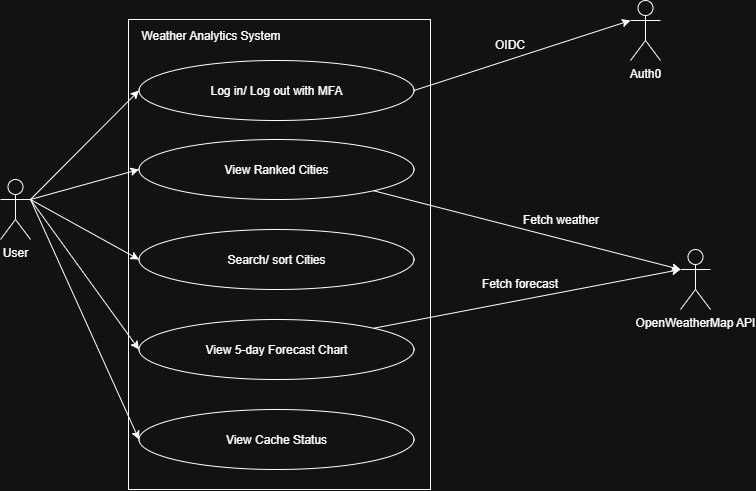
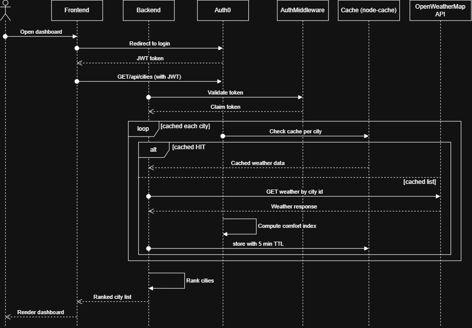
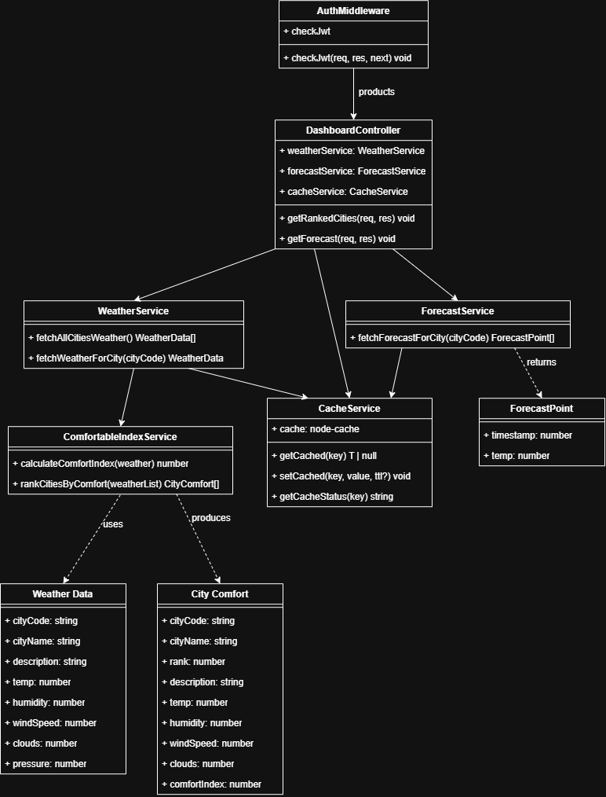
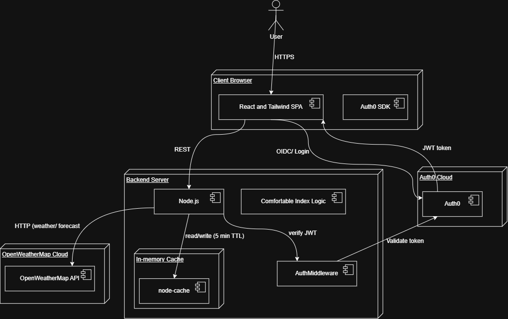

# Weather Analytics Application

This is a full-stack weather analytics application that retrieves live weather data for 10+ cities, computes a custom Comfort Index score for each, and presents a ranked, authenticated dashboard with forecast trends.

---

## Table of Contents

- [Tech Stack](#tech-stack)
- [Architecture](#architecture)
- [Project Structure](#project-structure)
- [Setup Instructions](#setup-instructions)
- [Comfort Index Formula](#comfort-index-formula)
- [Trade-offs Considered](#trade-offs-considered)
- [Cache Design](#cache-design)
- [Testing](#testing)
- [Limitations](#limitations)
- [Features Implemented](#features-implemented)
- [API Endpoints](#api-endpoints)
- [Docker Setup](#docker-setup)
- [Screen Recording](#screen-recording)

---

## Tech Stack

| Layer | Technology |
|---|---|
| Backend | Node.js, Express, TyperScript |
| Frontend | React, TypeScript, Vite, Tailwind CSS v4 |
| Authentication | Auth0 (login/logout, MFA, JWT verification) |
| Caching | node-cache (in-memory) |
|Charts | Recharts (5-day forecast visualization) |
| Testing | Jest and ts-jest |
| Containerization | Docker |
||

I chose this stack because I'm currently studying React, TypeScript, and Node/Express, and I wanted to build something real rather than just follow tutorials. Auth0 was the specified authentication provider. This let me focus my time on the parts that mattered most: designing the Comfort Index formula and getting the Auth0 integration working correctly.

---

## Architecture

### Use CASE Diagram
- What a logged-in user can do with the system

 

### Sequence Diagram
- The flow for a dashboard request, from login through cache to the external weather API



### Class Diagram
- The core backend objects and how they are structured



### Deployment Diagram
- Where each piece actually runs



---

## Project Structure

```
weather-app
├── docker-compose.yml
├── .env
├── README.md
├── docs/
│   └── design-exploration.md
├── diagrams/
│   ├── use_case_diagram.drawio.png
│   ├── sequence_diagram.drawio.png
│   ├── class_diagram.drawio.png
│   └── deployment_diagram.drawio.png
├── server/
│   ├── Dockerfile
│   ├── .env
│   └── src/
│       ├── data/cities.json
│       ├── middleware/checkJwt.ts
│       ├── services/
│       │   ├── weatherService.ts
│       │   ├── comfortIndexService.ts
│       │   ├── comfortIndexService.test.ts
│       │   ├── cacheService.ts
│       │   └── forecastService.ts
│       ├── types/weather.ts
│       └── index.ts
└── client/
    ├── Dockerfile
    ├── .env
    └── src/
        ├── components/TemperatureChart.tsx
        ├── App.tsx
        └── main.tsx

```

---

## Setup Instructions

### Backend
```bash
cd server
npm install
```
Create `server/.env`:
```env
OPENWEATHER_API_KEY=your_openweathermap_api_key
PORT=5000
AUTH0_DOMAIN=your-tenant.us.auth0.com
AUTH0_AUDIENCE=https://your-api-identifier
```
```bash
npm run dev    # development
npm test       # run unit tests
npm run build  # compile TypeScript to dist/
npm start      # run compiled build
```
 
### Frontend
```bash
cd client
npm install
```
Create `client/.env`:
```env
VITE_AUTH0_DOMAIN=your-tenant.us.auth0.com
VITE_AUTH0_CLIENT_ID=your_spa_client_id
VITE_AUTH0_AUDIENCE=https://your-api-identifier
```
```bash
npm run dev         # deployment
npm run build       # production build
npm run preview     # preview production build
```

### Auth0 Configuration

| Setting | Value |
|---|---|
| Application Type | Single Page Application |
| Allowed Callback URLs | `http://localhost:5173` |
| Allowed Logout URLs | `http://localhost:5173` |
| Allowed Web Origin URLs | `http://localhost:5173` |
| API Identifier | `https://your-api-identifier` |
| API Access Policy (user-delegated) | **Allow All Applications** — see Limitations |
| MFA | OTP primary, Email secondary, enforcement: Always |
| Public Signups | Disabled |
| Test User | `careers@fidenz.com` / `Pass#fidenz` |
||
 
> **Note:** if your Auth0 tenant is new, the custom API's user-delegated access policy must be explicitly set to "Allow All Applications." Without this, a correctly configured SPA still fails with `invalid_request: Client is not authorized to access resource server` — see Limitations for details.

---

## Comfort Index Formula

**What it is:** a 0–100 score combining four weather factors into a single ranking metric for each city.

**Why I designed it this way:** comfort perception isn't one number you can measure directly, it's a combination of how hot/humid it feels, how windy, how cloudy, and how stable the air pressure is. I wanted each factor's weight to reflect how strongly it's backed by evidence, not just my own guess.
 
**How it works (the four components):**
 
**1. Temperature and Humidity (70% weight)**: computed via **Thom's Discomfort Index (1959)**, a published formula for human heat perception:
```
Id = T − 0.0055 × (100 − RH) × (T − 14.5)
```
This models evaporative cooling mathematically: at low humidity, more heat is subtracted from perceived temperature (sweat evaporates, body cools); at high humidity, almost nothing is subtracted (sweat can't evaporate, perceived temperature converges to actual temperature). `Id` is mapped to a 0–100 score, peaking in the comfortable band 15–21, with a linear penalty of 5 points per unit outside that band.
 
**2. Wind speed (10% weight)**: ANSI/ASHRAE Standard 55 names air speed as a core environmental comfort factor. Ideal range: 2–5 m/s; penalized both when stagnant and when excessive.
 
**3. Cloud cover (10% weight)**: not part of ASHRAE 55 (an indoor-focused standard); my own extension accounting for outdoor solar exposure. Ideal range: 20–60% cover.
 
**4. Pressure (10% weight)**: standard atmospheric pressure (~1013 hPa) is associated with stable, fair weather.
- Ideal range: 1010–1020 hPa
- Penalized: low pressure (associated with storms) and unusually high pressure
```
Temperature score:  ideal 20–26°C → 100; else 100 − 4 × (°C outside range), floored at 0
Humidity score:     ideal 30–60% → 100; else 100 − 1.5 × (% outside range)
                    penalty × 1.8 if temp > 28°C (interaction effect)
Wind score:         ideal 2–5 m/s → 100; else 100 − 8 × (m/s outside range), floored at 0
Cloud score:        ideal 20–60% → 100; else 100 − 0.5 × (% outside range), floored at 0
Pressure score:     ideal 1010–1020 hPa → 100; else 100 − 0.5 × (hPa outside range), floored at 0
```
 
```
ComfortIndex = 0.65 × discomfortIndexScore(Id)
             + 0.10 × windScore
             + 0.10 × cloudScore
             + 0.10 × pressureScore
             + 0.05 × visibilityScore
```
 
**What this achieves:** temperature+humidity dominates (70%) because it's backed by a cited, published formula rather than an invented multiplier. The remaining 30% is split evenly across wind, cloud, and pressure, each a reasonable, self-designed extension rather than a cited relationship.
 
An earlier hand-tuned design and an alternative Gaussian-based model were also explored before settling on this version, see [`docs/design-exploration.md`](./docs/design-exploration.md) for the full comparison and reasoning.

---

## Trade-offs Considered
 
- Thom's Discomfort Index and ASHRAE 55 were designed primarily for indoor/controlled environments; applying them to outdoor weather API data is a reasonable adaptation, not a perfect fit.
- Wind, cloud, and pressure scoring use hand-picked ideal ranges rather than a published formula, since no equivalent standard exists for these the way Thom's formula exists for temperature/humidity.
- In-memory caching (node-cache) was chosen over Redis for simplicity, no extra infrastructure needed for a 10-city dataset. Would not scale to a distributed/multi-instance deployment.
- Temperature trend graphs use OpenWeatherMap's free 5-day/3-hour forecast endpoint instead of true historical data, which the free tier doesn't provide at all.
---
 
## Cache Design
 
| Cache type | Key pattern | TTL | Reason |
|---|---|---|---|
| Current weather | `weather:{cityCode}` | 5 minutes | Required by assignment |
| Forecast data | `forecast:{cityCode}` | 30 minutes | Changes far less often than live conditions |
 
**Cache flow:**
1. Request arrives → check cache
2. HIT → return cached data (no API call)
3. MISS → fetch from OpenWeatherMap, store with TTL, return
4. Debug endpoint (`GET /api/debug/cache`) reports HIT/MISS per key
I verified this by confirming identical values across repeated calls within the TTL window, and confirming the debug endpoint reports `HIT` for all cached cities.
 
---
 
## Testing
 
**What's tested:** the `calculateComfortIndex` and `rankCitiesByComfort` functions in `comfortIndexService.ts`, both pure functions with no external dependencies, which makes them fast and reliable to test in isolation.
 
**Why these specifically:** this is the core logic the entire assignment is graded on, so I wanted more than "does it run", I wanted proof the actual design decisions work as intended.
 
**How 9 tests, covering:**
- Mild, dry, breezy conditions score high (comfortable)
- Hot and humid conditions score low (uncomfortable)
- Scores are always clamped between 0 and 100, even for extreme input
- **The temperature-humidity interaction effect specifically** same humidity, different temperatures, confirming the hotter city scores lower (this directly verifies Thom's Discomfort Index behaves as intended, not just that the code runs)
- Scores are rounded to 2 decimal places
- Cities are ranked in descending comfort order with sequential rank numbers
- A single-city list doesn't crash
- An empty list doesn't crash
- Visibility penalty, low visibility scores lower than clear visibility

Run with:
```bash
cd server
npm test
```

**TEST OUTPUT**
```
 npm test   

> server@1.0.0 test
> jest

 PASS  src/services/comfortIndexService.test.ts (13.654 s)
  calculateComfortIndex
    √ mild, dry, breezy, conditions score high (comfortable) (15 ms)
    √ hot and humid conditions score low (uncomfortable) (3 ms)
    √ score is always clamped between 0 and 100 (2 ms)
    √ humidity penalty is stronger when it is already hot (intersection effect) (3 ms)
    √ returns a number rounded to 2 decimal places (2 ms)
    √ visibility penalty: low visibility scores lower than clear visibility (2 ms)
  rankCitiesByComfort
    √ ranks cities from most to least comfortable (6 ms)
    √ handles a single city without errors (5 ms)
    √ handles an empty list without errors (5 ms)

Test Suites: 1 passed, 1 total
Tests:       9 passed, 9 total
Snapshots:   0 total
Time:        14.833 s, estimated 28 s
Ran all test suites.
```
 
---
 
## Limitations
 
1. **Auth0 API Access Policy**: newer Auth0 tenants require the custom API's user-delegated access policy to be explicitly set to "Allow All Applications" otherwise a correctly configured SPA still receives `invalid_request: Client is not authorized to access resource server`, even with correct Domain/Client ID/Audience values. This is a recently introduced Auth0 feature not covered by most existing tutorials.
2. **MFA via Email requires a primary factor first**: Auth0 does not allow Email to be enabled as a standalone MFA factor — it must be a secondary/fallback option alongside a primary factor (OTP, in this implementation).
3. **Auth0 session persistence**: by default, `@auth0/auth0-react` stores tokens in memory and relies on third-party-cookie-based silent re-authentication on page refresh, which modern browsers increasingly block. Fixed via `cacheLocation="localstorage"` and `useRefreshTokens={true}`.
4. **Temperature trend graphs use a 5-day/3-hour forecast**, not a true 7-day daily forecast (part of OpenWeatherMap's paid One Call API) or genuine historical data (not available on the free tier at all).
5. **In-memory cache does not persist across server restarts** and would not work correctly across multiple server instances without a shared store (e.g. Redis) in a production deployment.
6. **No database**: the application does not persist user data or readings across sessions; this is a deliberate scope choice for this assignment.
7. **Visibility data from OpenWeatherMap's free tier**, often defaults to 10,000 meters (10km) for many cities when no specific data is available. This is a limitation of the free API, not the application logic. The visibility parameter still functions correctly when actual data is provided (e.g., during fog, haze, or heavy rain).
---
 
## Features Implemented
 
- **Dark mode**: persisted via localStorage, respects OS preference by default. *Why:* a small but expected UX detail for a modern dashboard. *How:* a custom `useDarkMode` hook toggles a `.dark` class on `<html>`, which Tailwind's `dark:` variants respond to.
 
- **Unit tests**: 9 tests covering scoring, clamping, the temperature-humidity interaction effect, and ranking (see [Testing](#testing) above for full detail).
 
- **Sorting and search filtering**: sort by comfort, temperature, or name; filter by city name. *Why:* makes the dashboard usable once there's more than a handful of cities. *How:* computed client-side with `useMemo`, so it doesn't require any backend changes or re-fetching.
 
- **Temperature trend graphs**: real 5-day/3-hour forecast data per city, rendered with Recharts. *Why:* the assignment's bonus list asks for a temperature trend graph; I chose real forecast data over synthesizing fake historical data. *How:* a dedicated `/api/forecast/:cityCode` endpoint, cached separately from current weather with a longer 30-minute TTL.
 
- **Visual polish**: color-coded comfort levels (emerald/amber/rose), glassmorphism styling, subtle fade-in animations. *Why:* makes the ranking scannable at a glance rather than requiring the viewer to read every number. *How:* a `getComfortStyle()` helper maps score thresholds to Tailwind color classes; translucency and backdrop blur are applied via Tailwind utilities.
 
- **Dockerized deployment**: multi-stage builds for both frontend and backend, so final images don't contain source code or dev dependencies.
 
---
 
## API Endpoints
 
| Method | Endpoint | Auth required | Description |
|---|---|---|---|
| GET | `/api/health` | No | Health check |
| GET | `/api/cities` | Yes | Ranked cities with Comfort Index |
| GET | `/api/forecast/:cityCode` | Yes | 5-day/3-hour forecast for one city |
| GET | `/api/debug/cache` | No | Cache HIT/MISS status per key |
 
---

## Docker Setup
 
### Prerequisites
- Docker Desktop (or Docker Engine + Compose)
- `server/.env` configured with your API keys and Auth0 credentials
- A root-level `.env` with the client's Auth0 build variables:
```env
VITE_AUTH0_DOMAIN=your-tenant.us.auth0.com
VITE_AUTH0_CLIENT_ID=your_spa_client_id
VITE_AUTH0_AUDIENCE=https://your-api-identifier
```
 
Vite environment variables are baked into the frontend bundle at build time, not read at container runtime, I pass them into the client image via Docker Compose's `build.args`, which reads from this root `.env`.
 
### Run
```bash
docker-compose up --build
```
Open `http://localhost:5173`.
 
### Services
 
| Service | Image | Port Mapping |
|---|---|---|
| Backend | Node.js 20 Alpine | `5000:5000` |
| Frontend | Nginx Alpine | `5173:80` |
 
The frontend runs in the user's browser, not inside the Docker network, so it reaches the backend via the host-mapped port (`http://localhost:5000`), not an internal Docker service hostname.
 
### Docker Commands
```bash
docker-compose up --build   # Build and start all services
docker-compose up -d        # Run in background
docker-compose down         # Stop all services
```

## Docker Images on Docker Hub

| Service | Image |
|---------|-------|
| Backend | [`dunith26docker/weather-app-server:latest`](https://hub.docker.com/r/dunith26docker/weather-app-server) |
| Frontend | [`dunith26docker/weather-app-client:latest`](https://hub.docker.com/r/dunith26docker/weather-app-client) |

Run with:
```bash
docker-compose up
```

---

## Live Recording
- **Part 1 — Design decision walkthrough:** I explain the Comfort Index formula's evolution (Formula A → B → C) and why I grounded the temperature-humidity interaction in Thom's Discomfort Index rather than an invented constant.
- **Part 2 — Live extension:** I added Visibility as a new parameter to the formula, live and unscripted. After adding the scoring function (8,000m threshold, 5% weight) and rebalancing the weights, the ranking recalculated correctly, confirming the new parameter is wired in properly.

> Recording link: https://drive.google.com/file/d/1uinaCygro5cZlGYdN29SDp1wsyjdUCeb/view?usp=sharing

---

**Dunith Desitha Athukorala**
